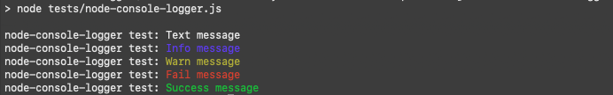

# node-console-logger
A few colors for that symbols world

## About
Small js library to make your debugging (or anything else) in node more colorful (or understandable).

Attention: now it isn't available at npm. You can use it locally only 

### Installation
```bash
// In your directory
git clone git@github.com:nbrylevv/node-console-logger.git
```

### Usage
```js
// Your NodeJS script
const { NodeConsoleLogger } = require('node-console-logger/src/node-console-logger');

const nodeConsoleLogger = new NodeConsoleLogger('Your project name');
nodeConsoleLogger.success('Everything works!');
```

### [Example](tests/node-console-logger.js)

